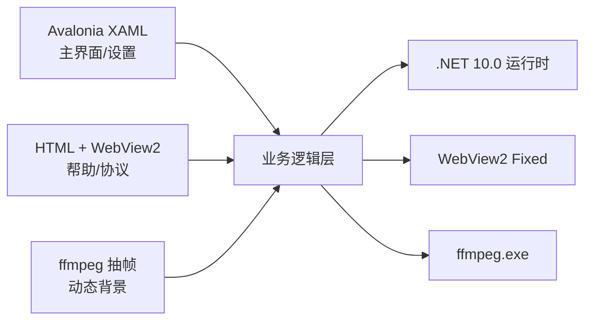

# TE 终端盒子 v1.0.0-beta

### 一款绿色、高颜值的 Windows 终端美化工具，后续版本将支持linux终端，termux终端

---
## ⚠️ 重要提示

**Gitee 仅作为镜像站点，不提供 Issue 支持。**

如有任何问题、Bug 反馈或功能建议，请前往 GitHub 提交 Issue：

👉 **[github.com/siyecao-mengs/TE/issues](https://github.com/siyecao-mengs/TE/issues)**

---

### 🔗 相关链接

| 平台 | 地址 |
|------|------|
| **GitHub 仓库** | [github.com/siyecao-mengs/TE](https://github.com/siyecao-mengs/TE) |
| **GitHub Issues** | [提交反馈](https://github.com/siyecao-mengs/TE/issues) |
| **Gitee 镜像** | [gitee.com/siyecao-meng/TE](https://gitee.com/siyecao-meng/TE) |
| **下载 Release** | [最新版本](https://github.com/siyecao-mengs/TE/releases) |

---

## 功能说明
- 🖥️ 多终端支持 内置 CMD + PowerShell，开箱即用
- 🎨 终端窗口支持视频背景
- 🪟 无边框设计 极简沉浸式体验
- 💚 绿色免安装 纯绿色软件，不写注册表，复制即用
- 🎨 自由更改动态壁纸

---

## 技术栈

| 层级 | 技术 | 说明 |
|------|------|------|
| **UI 框架** | Avalonia 12.1.0 | 跨平台 .NET 桌面 UI 框架 |
| **UI 辅助** | HTML5 + CSS3 | 帮助文档、关于页面、群规等用浏览器内核渲染 |
| **运行时** | .NET 10.0 | 微软最新 .NET 运行时 |
| **开发语言** | C# | 核心逻辑、界面交互、Shell 管理 |
| **浏览器内核** | Edge WebView2（Fixed Version） | 嵌入独立 WebView2 运行时，加载 HTML 帮助文档与用户协议 |
| **视频引擎** | ffmpeg 8.1.2 | 独立进程调用，视频抽帧 + 图片背景渲染 |
| **动画方案** | ffmpeg 逐帧提取 + Timer 轮播 | 提取视频关键帧序列，定时器循环切换实现动态背景 |
| **终端管理** | System.Diagnostics.Process | CMD / PowerShell 进程管理，标准输入输出重定向 |
| **存储** | 本地 JSON | 用户配置、卡片数据、壁纸路径均存储为本地 JSON 文件 |
| **版本检测** | GitHub API / Gitee API | 获取最新 Release 版本号，提示更新 |
| **打包** | dotnet publish + Self-contained | 自包含单文件发布，无需安装 .NET 运行时 |

## 第三方依赖

| 依赖 | 版本 | 协议 | 用途 |
|------|------|------|------|
| Avalonia UI | 12.1.0 | MIT | 跨平台 UI 框架 |
| Avalonia.Controls.WebView | 12.0.1 | MIT | 浏览器控件（底层 Edge WebView2） |
| Avalonia.Themes.Fluent | 12.1.0 | MIT | Fluent 风格主题 |
| Avalonia.Fonts.Inter | 12.1.0 | MIT + SIL OFL | Inter 字体 |
| ffmpeg | 8.1.2 | LGPL v2.1+ | 视频抽帧处理（独立进程调用） |
| ProIcons | — | MIT | 图标库 |
| WebView2 Fixed Version | 151.x | Microsoft 分发协议 | 独立浏览器运行时，嵌入 HTML 渲染 |

## 应用架构

---

