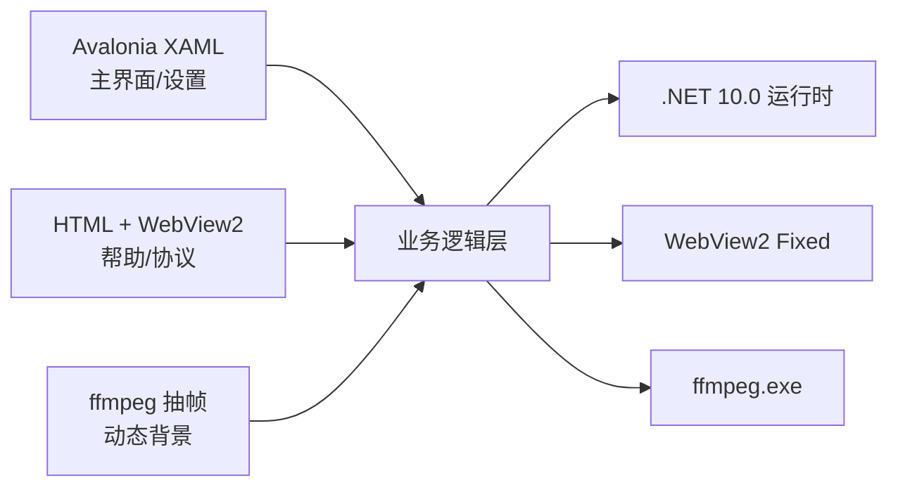

# TE 终端盒子 v1.0.1 首个正式版

### 一款绿色、高颜值的 Windows 终端美化工具，后续版本将支持linux终端，termux终端

---
## ❓ 常见问题解答

### 1. 如何下载该软件？

从以下两个平台下载最新版本：

- **GitHub**：[点击下载](https://github.com/siyecao-mengs/TE/releases)
- **Gitee（国内镜像）**：[点击下载](https://gitee.com/siyecao-meng/TE/releases)

---

### 2. 为什么没有安装引导？如何运行软件？

该软件为**绿色便携版**，无需安装引导。

解压后将看到一个以 `TerminalEmbellish.Desktop.exe` 命名的可执行文件（带软件图标），**双击即可直接运行**。软件不写注册表、不创建系统文件，想卸载直接删除文件夹即可。

---

### 3. 如何在桌面创建快捷方式？

1. 打开软件所在文件夹
2. 找到 `TerminalEmbellish.Desktop.exe`（带软件图标）
3. 右键 → **创建快捷方式**
4. 将生成的快捷方式文件**拖到桌面**即可

---

### 4. 双击软件没有任何反应？

可能的原因及解决方法：

| 原因 | 解决方法 |
|------|----------|
| 操作系统过旧 | 该软件兼容 **Windows 10 / Windows 11**，请确认系统版本 |
| 安全软件拦截 | 检查是否被 Windows Defender 或其他杀毒软件拦截，尝试将软件加入**白名单** |
| 系统环境异常 | 尝试**重启电脑**后再次运行 |

如以上方法均无效，请向作者反馈：**[提交 Issue](https://github.com/siyecao-mengs/TE/issues)**

---

### 5. 无法上传图片或视频？

可能是文件格式与软件解码器不兼容。

**目前支持的格式：**

| 类型 | 支持格式 |
|------|----------|
| **图片** | `.png` `.jpg` `.jpeg` |
| **视频** | `.mp4` `.avi` `.webm` |

> ⚠️ 视频文件需依赖系统解码器，部分编码格式（如 H.265、AV1）可能无法正常播放。建议使用 H.264 编码的 MP4 文件以获得最佳兼容性。

---

### 6. 软件提示"缺少 .NET 运行时"怎么办？

下载并安装 [.NET 10 运行时](https://dotnet.microsoft.com/download/dotnet/10.0) 即可。

或者直接下载**自包含版**（文件名不带 `light` 的版本），无需安装 .NET。

---

### 7. 如何切换终端类型？

1. 打开软件
2. 点击主页面右上角的 **"+"** 按钮
3. 在弹出的添加终端窗口中，选择 **CMD** 或 **PowerShell**
4. 点击右下角按钮添加终端卡片

---

### 8. 如何更换主页面壁纸？

1. 点击主页面左上角 **三个点** → **页面设置**
2. 点击 **通用设置** 下的 **"更换主页面壁纸"**
3. 选择图片或视频文件
4. 壁纸即时生效

想要恢复默认壁纸？点击 **"还原默认壁纸"** 即可。

---

### 9. 软件会自动更新吗？

不会自动更新，但设置页面会**自动检测新版本**。

打开 **页面设置**，在顶部即可看到当前版本号和更新状态：
- `[已是最新]` — 无需更新
- `[发现新版]` — 前往 GitHub/Gitee 下载最新版

---

### 10. 如何备份和恢复终端配置？

**备份：**

将以下目录复制保存：
C:\Users<你的用户名>.TerminalEmbellish\

text

**恢复：**

将备份的 `.TerminalEmbellish` 文件夹放回原位置即可。

---

### 11. 软件收费吗？

**完全免费，开源（MIT 协议）。**

你可以自由使用、修改、分发，甚至商用。无需付费。

---

### 12. 如何反馈 Bug 或提建议？

👉 **[提交 Issue](https://github.com/siyecao-mengs/TE/issues)**

反馈时请尽量包含：
- 软件版本号（设置页面可查看）
- 操作系统版本
- 问题描述 + 截图

---

### 13. 为什么 Edge 浏览器提示"无法安全下载"？

因为软件没有购买数字签名证书。

**解决方法：**
- 下载 `.zip` 版本，解压后运行
- 或在 Edge 下载提示中点击 `...` → **保留** → **仍然保留**

软件安全无毒，代码完全开源，可自行审查。

---
## ⚠️ 重要提示

**Gitee 仅作为镜像站点，不提供 Issue 支持。**

如有任何问题、Bug 反馈或功能建议，请前往 GitHub 提交 Issue：

👉 **[github.com/siyecao-mengs/TE/issues](https://github.com/siyecao-mengs/TE/issues)**

---

### 🔗 相关链接

| 平台 | 地址 |
|------|------|
| **GitHub 仓库** | [github.com/siyecao-mengs/TE](https://github.com/siyecao-mengs/TE) |
| **GitHub Issues** | [提交反馈](https://github.com/siyecao-mengs/TE/issues) |
| **Gitee 镜像** | [gitee.com/siyecao-meng/TE](https://gitee.com/siyecao-meng/TE) |
| **下载 Release** | [最新版本](https://github.com/siyecao-mengs/TE/releases) |

---

## 功能说明
- 🖥️ 多终端支持 内置 CMD + PowerShell，开箱即用
- 🎨 终端窗口支持视频背景
- 🪟 无边框设计 极简沉浸式体验
- 💚 绿色免安装 纯绿色软件，不写注册表，复制即用
- 🎨 自由更改动态壁纸

---

## 技术栈

| 层级 | 技术 | 说明 |
|------|------|------|
| **UI 框架** | Avalonia 12.1.0 | 跨平台 .NET 桌面 UI 框架 |
| **UI 辅助** | HTML5 + CSS3 | 帮助文档、关于页面、群规等用浏览器内核渲染 |
| **运行时** | .NET 10.0 | 微软最新 .NET 运行时 |
| **开发语言** | C# | 核心逻辑、界面交互、Shell 管理 |
| **浏览器内核** | Edge WebView2（Fixed Version） | 嵌入独立 WebView2 运行时，加载 HTML 帮助文档与用户协议 |
| **视频引擎** | ffmpeg 8.1.2 | 独立进程调用，视频抽帧 + 图片背景渲染 |
| **动画方案** | ffmpeg 逐帧提取 + Timer 轮播 | 提取视频关键帧序列，定时器循环切换实现动态背景 |
| **终端管理** | System.Diagnostics.Process | CMD / PowerShell 进程管理，标准输入输出重定向 |
| **存储** | 本地 JSON | 用户配置、卡片数据、壁纸路径均存储为本地 JSON 文件 |
| **版本检测** | GitHub API / Gitee API | 获取最新 Release 版本号，提示更新 |
| **打包** | dotnet publish + Self-contained | 自包含单文件发布，无需安装 .NET 运行时 |

## 第三方依赖

| 依赖 | 版本 | 协议 | 用途 |
|------|------|------|------|
| Avalonia UI | 12.1.0 | MIT | 跨平台 UI 框架 |
| Avalonia.Controls.WebView | 12.0.1 | MIT | 浏览器控件（底层 Edge WebView2） |
| Avalonia.Themes.Fluent | 12.1.0 | MIT | Fluent 风格主题 |
| Avalonia.Fonts.Inter | 12.1.0 | MIT + SIL OFL | Inter 字体 |
| ffmpeg | 8.1.2 | LGPL v2.1+ | 视频抽帧处理（独立进程调用） |
| ProIcons | — | MIT | 图标库 |
| WebView2 Fixed Version | 151.x | Microsoft 分发协议 | 独立浏览器运行时，嵌入 HTML 渲染 |

## 应用架构

---

